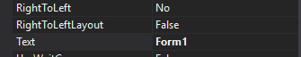
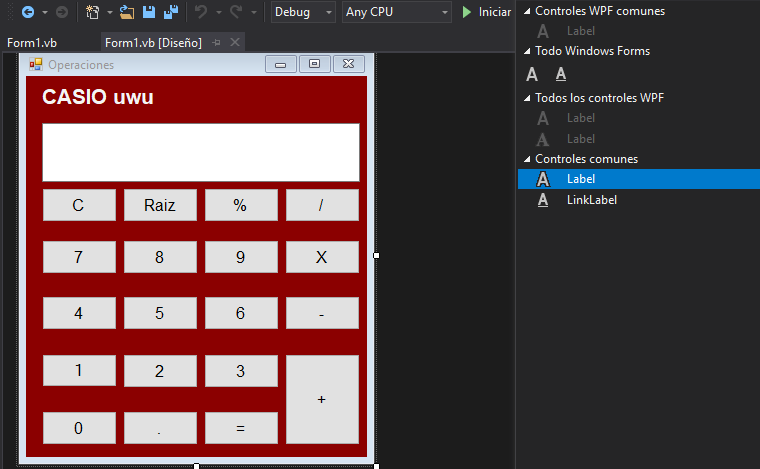

# Apuntes de Windows Forms UAT
### Variables Static
Para declarar variables estaticas son las que tienen un valor fijo:
```vb
Static Variable_static As String
Variable_static= "Hola Mundo"
Msgbox(Variable_Static)
```
Este comando sirve para mostrar un mensaje de tipo especifico en un boton:
```vb
'Se pone primero el mensaje que se va a mostrar, Elegir el estilo y el nombre del boton'
Msgbox("Hola Mundo",Msgbox.Style.Information,"Information")
```
¿Como cambiar el nombre de tu formulario?
* Buscar en el Apartado de **Text**


¿Como usar un textBox para que imprima un resultado?
Para eso se utiliza el siguiente comando
```vb
'Nombre del Textbox+.text="caracter"'
Textbox_Result.text="10"
```
¿Como crear un boton en Forms?
1. Busca el cuadro de herramientas
1. Encuentra la herramienta llamada "Label" y arrastrala al formulario



## ¿Como concatenar en Visual Basic?

