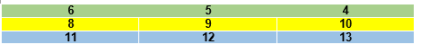

# Matrices

Conjunto de datos del mismo tipo, que son accedidos por medio de posiciones o indices para posteriormente utilizarlos en nuestros programas. Pero a diferencia de un Array de una dimension, una matriz tiene dos dimensiones, la cual cuenta con filas y columnas, parecido a una hoja de calculo.
> Importante: Siempre van a empezar con la posicion (0,0) y solo debe ser de un tipo de variable unico

## Como se Declara una Matriz
### Metodo General Comun

Para declararlos es igual que cuando lo hacemos con una variable normal solo que van a cambiar algunas cosas:
1. Se pone la Palabra `Dim` Al Principio
2. Se pone el **_Nombre de nuestra Matriz a crear_**
3. Se pone entre Parentesis :`(No. de Filas, No. de Columnas)`el tamaño de la matriz
4. Se  Despues pone la Palabra `As` + `Tipo de variable que tendran los datos de la Matriz`
```vb
Dim numeros (4,2) As Integer
'En realidad solo hay 3 Filas y 1 Columnas'
```
### Metodo General + New
Aqui en la misma declaracion se va a asignar valores en la Matriz:

1. Se pone la Palabra `Dim` Al Principio
2. Se pone el **_Nombre de nuestra Matriz a crear_**
3. Se Pone el Signo `=` + La palabra `New` + `Tipo de Variable`
4. Poner `(,)` + Entre Corchetes Poner: {**_{valor_1,valor_2,valor_3},{valor_4,valor_5,valor_6}_**}
> Las llaves secundarias que pongamos dentro de la Principal son las filas que contiene la Matriz y los valores numericos se le asigna a cada columna que exista

```vb
Dim numeros= New Integer(,){{6,5,4},{8,9,10}{11,12,13}}
'Los elementos de la Matriz deben de ser la misma cantidad de valores en cada fila.

```
> En realidad lo que hacemos es crear una pequeña tabla con 4 filas con sus columnas y los valores se almacenan de forma especifica. Recuerda que las llaves principales cuentan como fila tambien

Asi quedaria la Tabla:



### Metodo con For Anidado
Aqui vamos a pedirle al usuario que nos ingrese valores directamente desde las posiciones que el programa le vaya a dar:

- Declarar la Matriz en la Forma del **Metodo General Comun**
- La Estructura del `For` va a ser de la siguiente manera: `For` + `Variable contadora`**_(Este va a contar las Filas)_** + `To` + `Numero Maximo de Filas` + `Step` + **1**
- Se va a abrir otro `For` **_Secundario_**: `For` + `Variable contadora`**_(Este va a contar las Columnas)_** + `To` + `Numero Maximo de Columnas` + `Step` + **1**
- Dentro del `For` **_Secundario_** Se va a poner lo que es el Comando de Escritura para que el usuario vaya ingresando los valores. En este Caso usaremos el `Console.WriteLine` y se va a concatenar lo que seria las `variables contadoras` **_de las filas y columnas_**
- Se va a poner despues del `Console.WriteLine`: `nombre de la Matriz`+`(variable contadora de filas, variable contadora de columnas)` + `=` + `Console.ReadLine()`
```vb
        Dim numeros(4, 2) As Integer
        For filas = 0 To 3 Step 1
            For columnas = 0 To 1 Step 1
                Console.WriteLine("Ingresa el valor que se va a almacenar en" & filas & "," & columnas)
                numeros(filas, columnas) = Console.ReadLine()
            Next
        Next
        Console.ReadLine()
```

### Metodo Manual
Este Consiste en que nosotros le pongamos valores uno por uno a la matriz dependiendo de las posiciones que tenga:

- Crear una Matriz y Declararla en la Forma del **Metodo General Comun**
- Para signarle un valor a una posicion se hace de la sig manera: `nombre de la matriz`+ `(Posicion de Fila, Posicion de Columna)` + `=` + `valor que se va a almacenar`
- Declarar una **_variable_** donde almacenes el `valor` que se encuentra en el **_espacio especifico de la Matriz_**: `Dim`+ `nombre de la variable`+ `As`+`Tipo de variable` + `=` + `nombre de la matriz`+ `(No.fila,No.columna)`
```vb
Dim numeros (3,2) As Integer
numeros (0,0)= 18
numeros (0,1)= 20
numeros (1,0)= 30
numeros (1,1)= 40
numeros (2,0)= 50
numeros (2,1)= 60
Dim nom As Integer= numeros(2,1)
Console.WriteLine(nom)
Console.ReadLine()
```

### Mostrar elementos de una Matriz mediante el cilo For Each

Esto nos ayuda a mostar varios valores en diferentes espacion de la Matriz para eso ese utilizara este bucle anidado:

- Crea un bucle For de la sig manera: `For` + `variable contadora` + `=` + `el valor inicial que va a ser igual a 0` + `To` + `Nombre de nuestra matriz.GetUpperBound` + `(No. de Fila o Columna) - 1` + `Step`+ `1`
- Crea de la misma Forma dentro del`For Principal`, un `For Secundario`.
- Poner un metodo de Escritura para que imprima los valores
```vb
Dim numeros (3,2) As Integer
numeros (0,0)= 18
numeros (0,1)= 20
numeros (1,0)= 30
numeros (1,1)= 40
numeros (2,0)= 50
numeros (2,1)= 60

'Aqui va el For que hace referencia a las Filas'
For i= 0 To numeros.GetUpperBound(0)-1 Step 1
'Aqui va el For que hace referencia a las Columnas''
        For j= 0 To numeros.GetUpperBound(1) -1 Step 1
        Console.WriteLine(numeros(i,j))

```