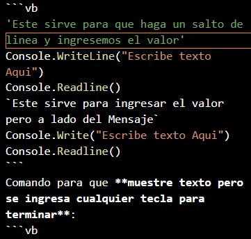

# Curso de Markdown
Sirve para hacer paginas web estaticas y te serviran mucho en tus apuntes pero tambien cuando hablemos de codigo.
## Comandos
Para aplicar _Cursiva_ en Mardown:
```md
//Encierra las Palabras entre guiones bajos:

_Hola_
```
Para Aplicar **negrita** en Markdown:
```md
// Encierra las palabras entre dos asteriscos en cada lado
**Hola Mundo**
```

**Ojo**: Si vas a utilizar dos formas de escritura o resaltado se debe de cumplir lo sig:
* El primer comando en usarse va a ser el ultimo en cerrarse
* El segundo comando en usarse va a ser el primero en cerrarse
Por ejemplo:
```md
**_ Hola Mundo_**
```
Para poner encabezados segun el orden:
```md
// Para titulos Principales
# Hola Mundo
// Para Subtitulos
## Hola Amigo
// Para subtitulos secundarios (Puedes Alcanzar el Nivel 7)
### Hola compañero
```
Para agregar enlaces en el documento:
* En los **corchetes** va a ir el texto que nosotros vamos a querer que se vaya a visualizar
* En los **Parentesis** va a ir el link de la Pagina
```md
[Hola Mundo](https://www.youtube.com/watch?v=FlsoBiteuPM)
```
Este sirve para que dirreciones en los enlaces las anclas de los encabezados de un tema.
```md
// Poner el signo de gato en los parentesis para que tome en cuenta los encabezados 

[Temas de Biologia](#comandos)
```
Para agregar Imagenes en el Archivo se va a usar lo mismo que en **enlaces**:
* En los corchetes va a ir el nombre de la Imagen
* En los parentesis se va a poner la forma en como nosotros invocaremos la imagen
* Tener las imagenes en una Carpeta dedicada solo a puras imagenes
```md
// Se pone el ! para que se vea la imagen en el archivo y se pone en el parentesis la ubicacion de la carpeta y el nombre del archivo


```
Sirven para agregar Diviciones a los parrafos:
```md
// Con estas lineas medias vas a poder dividir los textos

---
```
Sirve para hacer listas ordenadas y Desordenadas:
```md
// Lista Ordenada
1. Hola Mundo
// Lista Desordenada
* Hola Mundo
- Hola World
```

Sirve para hacer Citas en Linea:
* Se va a poner un > Para poner la Cita
* Se va a poner un - Para poner el Autor
```md
> Si no Pienso, No existo. - Descartes
```

Sirve para hacer Tablas:
```md
// Siempre poner la primera columna y dividirlas con el "|". Alt + 124

| Nombre | Edad | Apellido |
| --- | --- | --- |
| Misael | 18 | Hernandez
```

Sirve para que destaques palabras que funcionan en lenguajes de Programacion:
```md
// Siempre usar comillas simples

`Dim`
```

Sirve para que pongas un codigo completo en un bloque de un lenguaje propio:



Sirve para hacer Comentarios en Markdown:
```md
<!-- Aqui se hacen los comentarios igual que en Html -->
```

Sirve para darle escape a los caracteres de la sintaxis de Markdown:
```md
// Para que no detecte los caracteres especiales se usa el "\" alt+ 92

\_Hola Mundo_ Cursiva
\*\*Hola Mundo*\* Negrita
```
