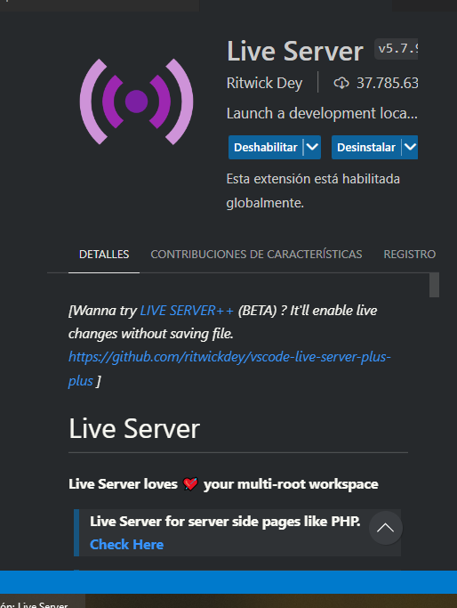
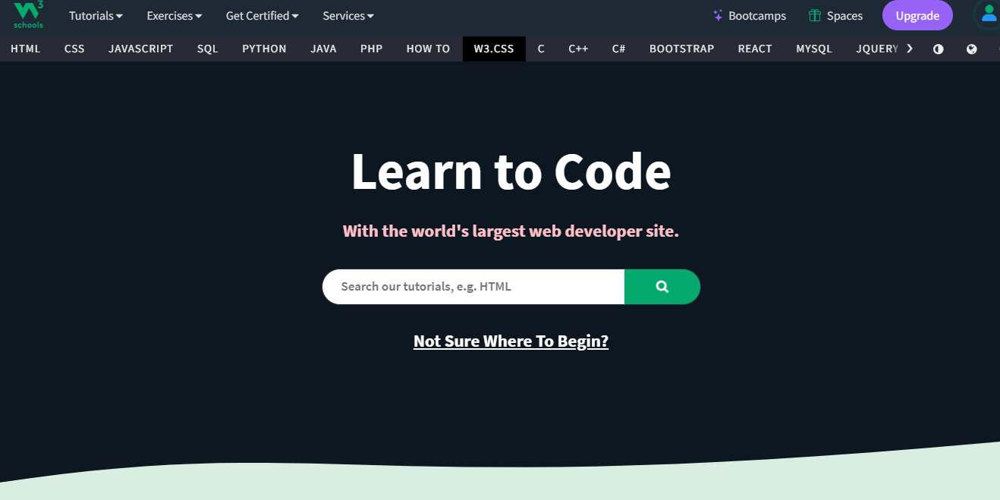
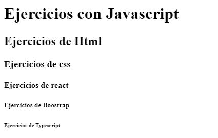
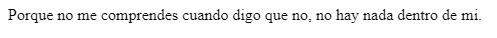
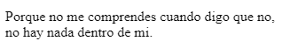
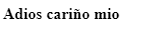

# **Sintaxis Basicas de Html y Conceptos Basicos**
El Lenguaje de Etiquetas HTML es la estructura de una Pagina web ya que sin ella no existen, Es un lenguaje tan simple y no exige mucho, pero no se debe de confundir que es un lenguaje de programacion debido a que **html solo es la base de una pagina web**. 

> **Html:** Si estas empezando en este mundo de la programacion web, estas en el lugar indicado :D

## Estructura de una Pagina web

 

* **_Header:_** Aqui es donde podemos agregar contenido en la **Parte Superior** de una Pagina web.

* **_Nav:_** En esta seccion se ubica nuestra barra de navegacion y esta es para navegar en los diferentes secciones         **(Archivos html)** de nuestra pagina

* **_Aside:_** Sirve para que se pueda agregar contenido en una **barra lateral**  de una Pagina web

* **_Footer:_** Sirve para que se pueda agregar contenido en la **Parte Inferior** de una Pagina web

* **_Main:_** Sirve para que se pueda agregar el  **Contenido Principal** de una Pagina web.

* **_Section:_** Sirve para que se pueda agregar contenido en una **seccion especifica**  de una Pagina web. Solo se va a usar cuando vas a introducir contenido importante a tu pagina web

* **_Article:_** Sirve para que se pueda agregar contenido en un **articulo especifico**  de una Pagina web

* **_Div:_** Sirve para que puedas acomodar algun apartado especifico de la pagina web ya que es como un espacio libre en tu pagina web.

## Empezando desde Cero
Para empezar en Html primero tienes que antes que nada tener un **IDE** instalado ya que este nos va a facilitar la tarea de la escritura de codigo. En este caso se usara **`Visual Studio Code`**.


<br>

>**Nota:** Aqui te dejo el link de como descargar visual studio code y configurarlo en lenguaje español: <a href="https://www.youtube.com/watch?v=X_Z7d04x9-E"> Dirijete aqui :D </a>
y tambien te dejo un video del como crear archivo en html en visual studio code.
<a href="https://www.youtube.com/watch?v=LfG7zr4zoYw"> ¡Click aqui!</a><br>

## Entorno de Trabajo
Aqui te dejare una lista de herramientas que vamos a ocupar para poder trabajar comodamente con visual studio code.

  - **_Live Server:_** Este nos ayuda a que nosotros podamos ver los cambios a tiempo real a la hora de estar desarrollando pagina web.
  

    </br>
 - **ChatGPT:** Si tienes duda en algo que no se explica aqui en los Apuntes puedes consultar ayuda a la inteligencia artifical.
  
</br>
 - **W3school:** Aqui tambien puedes encontrar informacion relacionada sobre html de forma mas clara y entendible. <a href="https://www.w3schools.com/"> ¡Click Aqui!</a>


## Etiquetas Basicas
En esta seccion te enseñare algunas etiquetas para que te vayas acostumbrando y descubrir que funcion hace cada una. Antes de enseñarte unas cosas me gustaria comentarte algo:

- Cada etiqueta que inicies siempre tiene que llevar un final.
- No todas las etiquetas necesitan cerrarse
- Si vas a usar mas de dos etiquetas recuerda que: **La primera siempre va a ser la ultima que se cierre**

```html
<!--Esta etiqueta se esta iniciando y se termina cuando se pone el "/" -->
<span> </span>
<!--La primera etiqueta que se abra va a ser la ultima que se cierre-->
<span> <p>Hola Mundo<p> </span>
```

<h4 style="color: #6791FF;"><b>Etiquetas de Texto</b></h4>

**title:** Esta etiqueta sirve para que le pongamos un nombre general a nuestra pagina web y este se muestra en las pestañas.


```html
<title>Hola Mundo</title>
```
> Normalmente esta etiqueta siempre se pone en el **`head`**

**H:** Esta etiqueta sirve para que poner titulos y subtitulos. Este va de orden Descente ya que este 6 niveles. **El 1 es el mas importante y el 6 es el menos importante**

```html
    <h1>Ejercicios con Javascript</h1>
    <h2>Ejercicios de Html</h2>
    <h3>Ejercicios de css</h3>
    <h4>Ejercicios de react</h4>
    <h5>Ejercicios de Boostrap</h5>
    <h6>Ejercicios de Typescript</h6>
```

**P:** Esta etiqueta sirve para poner texto. Nos ayuda mucho a escribir parrafos largos


```html
<p>Porque no me comprendes cuando digo que no, no hay nada dentro de mi.</p>
```
**br:** Este sirve para dar un salto de linea en un respectivo elemento. Normalmente se usa en los parrafos por ejemplo vamos a usar el texto anterior para separarlo.

```html
<p>Porque no me comprendes cuando digo que no, <br>no hay nada dentro de mi.</p>
```
> Esta etiqueta no se cierra

**b:** Esta etiqueta sirve para que nuestro texto se ponga en negritas.



```html
<p><b>Adios cariño mio</b></p>
```

**i:**

