# Introduccion a CSS 
Estas hoja de diseño nos van a permitir darle toda la creatividad a nuestra pagina web ya que es la encargada de darle el color,estilo,etc. Para usarlo necesitas cumplir con lo sig:

- Escojer una **etiqueta especifica** (Puede ser cualquiera) de Html
- Se van a limitar con llaves de **Apertura y Cierre**
- Elegir una **Propiedad o Select** y darle un valor
- Siempre se va a cerrar cuando acabemos de poner las propiedad el **;**


## Formateo de Pagina
Esto se hace al principio de una pagina para poder agregar elementos
```css
body{
    margin: 0px;
    padding: 0px;
    box-sizing: border-box;
    font-family: sans-serif;

}
```
> Css en caso que tengamos dos etiquetas html iguales. Lo que va a ser es escojer la ultima etiqueta con la que se trabajo ya que por eso se le conoce como **Estilo de Cascada**

```css
p{
color: red;

}
```
</br>
</br>

## **Propiedades de Texto**
- **Text align:** Sirve para que definir la orientacion o la ubicacion de nuestro texto que escojimos
```css
h1{
    text-align: Orientacion;

}

```
- **Color:** Este nos permitira cambiar el color que tengan las letras de nuestro texto o etiqueta escojido
```css
h1 
{
color: red;
}
```
- **Text Transform:** Sirve para modificar el parrafo principal de la gramatica. Ejemplo de como poner todo en Mayuscula:
```css
h1 
{
text-transform: uppercase;
}

```
- **Font Family**: Sirve para cambiar el tipo de Fuente que contiene el texto. 
```css
p{
    font-family: Arial, Helvetica, sans-serif;
}
```
> Si quieres tener mas Fuentes Externas tienes que biscar en la Pagina de **Google Fonts**
- **Font Weight:** Sirve para modificar el ancho de las letras de nuestro parrafo.
```css
p{
    font-weight: 200;

}
```
- **Font size** nos ayuda a aumentar o disminuir el tamaño de nuestro texto. Especificamos su tamaño en pixeles. Tambien se puede trabajar con **_em,rem_**:
1. **1 rem**= 10 px
1. **1em** = 16px
```css
span{
    font-size: 20px;
    font-size: 20rem;
    font-size: 20em;

}
```
## Propiedades del Fondo
- **Background-color:** Es el color de fondo que tiene una cierta seccion de nuestra pagina web
```css
nav{
    background-color: blue;

}
```
> Tambien puedes usar el comado `opacity` para poder poner opacidad en el color de nuestra pagina web

- **Background-image:** Este sirve para poner una imagen como fondo del elemento html
```css
.container{

    background-image: url(cheems.png);
}
```
> Si la imagen se repite horizontalmente puedes usar la propiedad `background-repeat`

- **Background-repeat:** Este sirve para controlar la repeticion de las imagenes de fondo en los elementos de html
```css
.container {
background-image: url('cheems.png');
background-repeat: no-repeat; /*or repeat-x(Horizontal) or repeat-y (Vertical) */
}
```
- **Background-Position:** Sirve para cambiar la posicion de la imagen que tenemos de fondo del elemento
```css
.container{
    background-image: url('cheems.png');
    background-position: right top;
}
```

- **Background-attachment:** Sirve para identificar si la imagen se va a desplazar o es fija
```css
.container{
    background-image: url('cheems.png');
    background-attachment: scroll; /* or fixes*/
}
```

- **Background-Size:** Sirve para establecer el ancho y alto de una imagen de fondo.
```css
.container{
    Background-image: url('cheems.png');
    Background-size: 100% 100%; /*Pixeles or Porcentajes or Palabras claves*/
}
```
> En las Palabras Claves estan **`auto`** que conserva su tamaño original, **`cover`** Se ajusta al tamaño de la imagen pero la recorta si es necesario y **`contain`** sirve para conservar toda la imaghen y ajustandola correctamente.

## Propiedades Width y Height

- **Width:** Sirve para determinar la anchura de un elemento determinado en html
```css
nav{
    width: 120rem;

}
```

- **Height:** Sirve para determinar el alto de un elemento determinado en html 
```css
nav{
    height: 120rem;

}
```

- **Float:** Este realiza la funcion de hacer flotar a la imagen ya sea a la izquiera o derecha
```css
img{
    float: right; /*or left*/

}
```


## Propiedades de los Bordes

- **Border-Style:** Sirve para cambiar el diseño del Borde de nuestro elemento html
```css
p{
    /*General*/
    border-style: solid 1px black;
    /*Lado Top*/
    border-top-style: solid;

}
```
> Tambien puedes especificar que lado quieres modificar del borde para que solo se modifique el que se menciona. Pero solo se puede especificar el tipo de borde a aplicar.


- **Border-Collapse:** Este sirve para checar si las celdas se encuentran separadas o unidas. Usualmente se usa en las tablas.
```css
.container{
    border-collapse: collapse; /*or separate*/
}
```
> Tienes que investigar los diferentes tipos de estilos de borders que existen

- **Border-Radius:** Sirva para que se pongan borders en las orillas de los elementos que queremos mostrar
```css
.container{
	border-radius: 15px;
}
```
- **Border-Width:** Este nos ayuda a especificar que tan ancho queremos la lineas de los bordes de los 4 lados.
```css
.container{
    border-style: solid 1px black;
    border-width: 5px;
    /*O Tambien puedes especificar de los lados: bottom,top,right,left*/
    border-width: 5px 5px;
}
```

- **Border-Color:** Este es para definir que color o colores vamos a querer que se ponga sobre el borde ya sea de un solo color o cada lado con diferente color.
```css
.container{
    /*Borde con 4 colores diferentes en cada lado*/
    border-color: red blue orange green;
}
```

### Propiedades Abreviadas de Border


## **Tipos de Margin**
- **margin-top** Sirve para determinar el espacio superior (Separacion) entre algunos elementos
```css
nav{
    margin-top: 0rem;

}
```

- **margin-right** Sirve para determinar el espacio Derecho (Separacion) entre algunos elementos
```css
nav{
    margin-right: 10rem;

}
```

- **margin-bottom** Sirve para determinar el espacio Inferior (Separacion) entre algunos elementos
```css
nav{
    margin-bottom: 10rem;

}
```

- **margin-left** Sirve para determinar el espacio Izquierdo (Separacion) entre algunos elementos
```css
nav{
    margin-left: 10rem;

}
```

- **Margin:** Se puede usar este para determinar las 4 Medidas de Separacion de cada lado siguiendo el siguiente orden:
1. Valor de `margin-top`
1. Valor de `margin-right`
1. Valor de `margin-bottom`
1. Valor de `margin-left`
> Lo tienes que separar por espacios y si hay medidas que se repiten solo deja los primeros 2 valores ya que css los considera para los 4.

```css
nav{
    margin: 0 auto 0 auto ;
    'Tambien se puede asi'
    margin: 0 auto;

}
```
## **Padding**
Sirve para rellenar el contenido  en una seccion de nuestra pagina web (Esto significa que se va a hacer mas amplio una cierta etiqueta)
> Cuando vayas a poner una medida ten cuidado ya que css lo va a multiplicar 4 veces.
```css
nav 
{
    padding: 1rem;'sea aqui van a ser 4rem'

}
```
- **Text-decoration:** Ayuda a que pogamos diferentes estilos en el texto de forma visual
```css
text-decoration: none;
```

- **Left:** Sirve para Mover hacia la derecha el elemento que vamos a querer que se Mueva
```css
.container{
	position:relative;
	left: 50px;
}
```
> Pero antes de hacer esto tienes que usar la propiedad `position` para que se pueda desplazar y tambien puedes desplazarlo en otras dirreciones. Si vas a usar el valor `absolute` asegurate quien es el padre que contiene el elemento

- **Bottom:** Sirve para Mover hacia arriba el elemento que queremos que se mueva
```css
.cointainer{
	position:relative;
	bottom: 50px;
}
```


> Existe un truco para que diferentes dispositivos puedan ver nuestra pagina web como las televisiones o smartwatch. y podremos trabajar comodamente con **rem**
```css
html{
    font-size: 62.5%;
}

body{
    font-size: 16px
}
```

</br>
</br>

## **Selectores**

Las reglas que se deben de cumplir para poner estilos son:

- **Especificar el selector que vamos a diseñar:** Esto nos va a ayudar ya que vamos a indicarle que solo el diseño va a ser unico en una cierta parte. Ejemplo:
```css
/* Solo va a aplicar al Elemento span que este dentro del h1 */
h1 span {
    font-size: 2rem;

}

```


- **Tipos de Selectores:**
1. **Selector Elemento:** Seleccionara un elemento a base de su etiqueta.
```css
p{
    color: blue;

}
```
2. **Selector de Clase:** Una clase se puede crear multiples veces e inicia con un punto.
```css
.cliente{
    color: red;

}
```
3. **Selector de ID:** Puedes tener multiples ID pero jamas se pueden repetir. 
```css
#cliente{
    color: blue;
}
```

4. **Selector de Atributos:** Seleccionar elementos basados en un atributo
```css
[src="logo.jpg"]{
    color: red;

}
```

5. **Combinacion de Descendentes:** Selecciona los elementos hijos cuyo padre es una clase (o ID) en especifico
```css
.cliente .nombre {
    color: blue;

}
```
6. **Todos los Hijos:** Aplica la regla a todos los parrafos hijos
```css
.cliente > p{
    color: red;
}
```

7. **Selectores con Propiedad:** Este nos ayuda a la hora de que queramos que nuestro css haga un diseño cuando el usuario hace cierta cosa (Evento). Ejemplo: Cuando pone el mouse en un boton
```css
.boton:hover{
    color: red;
    }
 ```

## **Especificacion**
Este nos va a ayudar a que no apliquen en todos nuestras etiquetas el mismo diseño ya que cuando nosotros solo queramos un diseño unico solo se va a aplicar al apartado en donde queremos modificar.

- **Etiqueta y clase:** Es decir si nosotros queremos solo modificar una etiqueta de una clase. Podemos hacer lo siguiente:
```css
/* Poner juntos la etiqueta y la clase*/
h1.cliente{
    font-size: Center;
    color: red;
}

.empleado span{
    font-size: Center;
    color: Blue;

}
```

## **Colores**
En css podemos usar colores de diferentes formas:
* **Normal:** Usar el nombre de los colores comunes. 
```css
p{
    color:blue;

}
```
* **Forma Hexadecimal:** Aqui en este se va a usar el lenguaje Hexadecimal ya sea de tres digitos o 6 digitos para especificar un color.
```css
p{
    color: #000000; /*Color Negro*/

}
```
</br>
</br>

**Pseudoelementos:** Es aquel elemento que no existe en tal en html y no es etiqueta sirviendo para almacenar variables de css llama **_custom properties_**

```css
:root{
    --Nombrevariable: valor;

    /*Ejemplo*/
    --Blanco: #ffffff;
    --Oscuro: #212121;
    --Primario:#FFC107;

}
```

Y si queremos usar los elementos que estan dentro de ellos se necesita la palabra clave `var`:
```css
p{
    color: var(--Blanco);

}
```
- **Border:** este sirve para poner un borde alrededor de un elemento de html y tambien se especifica el ancho de las lineas pero tambien el color:
```css
.container{
    border: 2px solid tomato;
}
```
 

## **Normalize**
Esta libreria  nos va a ayudar a que todos nuestros elementos se vean igual en los diferentes navegadores que existen.
> Es importante que la pongas en un documento diferente a tu pagina web debido a que puede ver actualizaciones y no se te dificulte el tabajo de cambiarlo.
</br>
</br>


### **Pasos**
1. Copiar todo el codigo de Normalize que se encuentra al dar clic al boton de **Download v8.0.1**.
> Puedes usar **ctrl + a** para seleccionar todo

2. Pegas el contenido en un archivo css **diferente al de tu pagina web**

3. Poner el siguiente etiqueta en tu codigo html
```html
<link rel=" preload" href="ubicacion del archivo normalize" >
```

## **FlexBox**
Fue diseñado como un modelo unidimensional para crear layouts. Una de sus caracteristicas es que solo puedes distribuir contenido en una sola dirrecion como **fila o row** o columna **column**. Sirve para alinear nuestras secciones.Otros valores serian:

* `row-reverse`
* `column`
* `column-reverse`
> Este nos ayiuda mucho a que nuestras paginas sean **Responsivas** y estas normaqlmente se ponen en las clases `padre` para que acomoden a los `hijos`
- **Row-Reverse:** Todos los elementos hijos se colocaran de:
1. **row:** de izquierda a derecha
2. **row-reverse:** de derecha a izquierda
```css
.container{
display: flex;
flex-direction: row /* or row-reverse*/
}
```
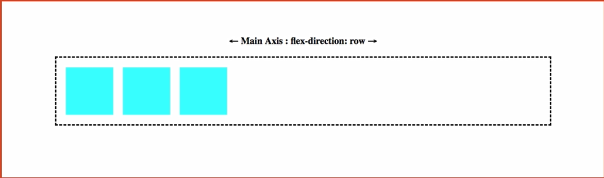
**Ejemplo:**
**Ejemplos de su uso:**
1. **Body:** Black (Contenedor Padre)
2. **Hijo1:** Red (Contenedor Hijo)
3. **Hijo2:** Aqua (Contendor Hijo)
> **row**
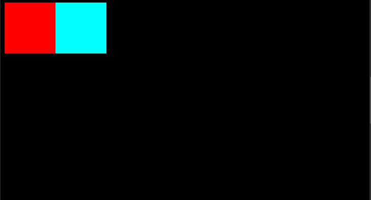
> **row-reverse**
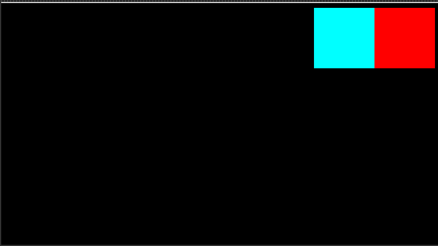

- **Column o Column-Reverse:** Sirve para que todos los elementos hijos se coloquen:
1. **Column:** De arriba a abajo
2. **Column-reverse:** De abajo hacia arriba
```css
.container{
display: flex;
flex-direction: column /* or column-reverse*/
}
```

**Ejemplo:**
**Ejemplos de su uso:**
1. **Body:** Black (Contenedor Padre)
2. **Hijo1:** Red (Contenedor Hijo)
3. **Hijo2:** Aqua (Contendor Hijo)
>**Column**
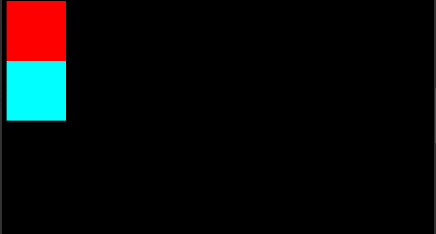
> **Column-reverse**
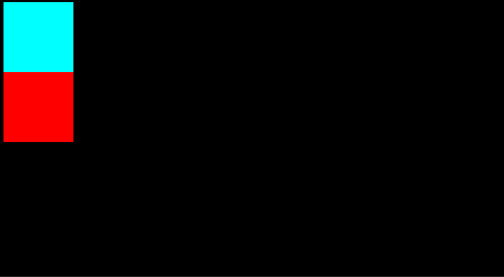


- **Flex-wrap:** Todos los elementos flexibles intentarán encajar en una línea:
1. **nowrap:** Todos los elementos flexibles estaran en una linea
1. **wrap:** Los elementos se ajustaran a varias lineas de arriba hacia abajo
1. **wrap-reverse** Los elementos se ajustaran a varias lineas de abajp hacia arriba
```css
.container{
    display:flex;
    flex-wrap: nowrap; /*or wrap and wrap-reverse*/
}
```


- **Flex-direction:** Es aquel en el que puedes distribuir las etiquetas de ciertas formas decidiendo su direccion.
```css
.container{
    display:flex;
    flex-direction: row; /*Viene por defecto*/
}
```
- **Display Flex** este ayuda a que todos los hijos del contenedor padre sean flexibles
```css
.container{
display: flex;
}
```

**Ejemplos de su uso:**
1. **Body:** Black (Contenedor Padre)
2. **Hijo1:** Red (Contenedor Hijo)
3. **Hijo2:** Aqua (Contendor Hijo)

> **Normal**

> **Con Flex**


- **Align-items:** Se utiliza para controlar cómo se alinean verticalmente los elementos de un contenedor flexbox o un contenedor de cuadrícula

```css
.container{
    display:flex;
    align-items: center; /* flex start or flex end or stretch or baseline*/
    }
 ```
 1. **Flex-start:** Los elementos se colocan al principio del eje transversal.
 1. **Flex.end:** Los elementos se colocan al final del eje transversal
 1. **Stretch:** Estirar para llenar el contenedor
 1. **Baseline**: Las líneas base son las mismas alturas en todos los elementos.
 **Ejemplos:**
- **Body:** Black (Contenedor Padre)
- **Hijo1:** Red (Contenedor Hijo)
- **Hijo2:** Aqua (Contendor Hijo)
- **Hijo3:** Orange (Contendor Hijo)
-  **Hijo5:** Green (Contendor Hijo)


 - **Justify-content** Ayuda a mover el texto de forma vertical,Justificada,centrada,etc.
1. **Flex start:** Los artículos se empaquetan hacia el inicio de la dirección flexible

2. **Flex-end:** Los artículos se embalan hacia el final de la dirección de flexión. 
 
3. **Center:** Los elementos se centran a lo largo de la 
4. **Space-between:** Los artículos se distribuyen uniformemente en la línea; el primer elemento está en la línea de inicio, el último elemento en la línea final
5. **Space-around:** Los artículos se distribuyen uniformemente en la línea con el mismo espacio alrededor de ellos. Tenga en cuenta que visualmente los espacios no son iguales, ya que todos los elementos tienen el mismo espacio en ambos lados
6. **Space-evenly:** Los elementos se distribuyen de modo que el espacio entre dos elementos cualesquiera

```css
nav{
    display: flex;
    justify-content:space-evenly /* flex-start or flex-end or center or space-between or space-around*/
}
```
**Ejemplos:**
1. **Body:** Black (Contenedor Padre)
2. **Hijo1:** Red (Contenedor Hijo)
3. **Hijo2:** Aqua (Contendor Hijo)
4. **Hijo3:** Orange (Contendor Hijo)
5. **Hijo5:** Green (Contendor Hijo)

> **flex-start**
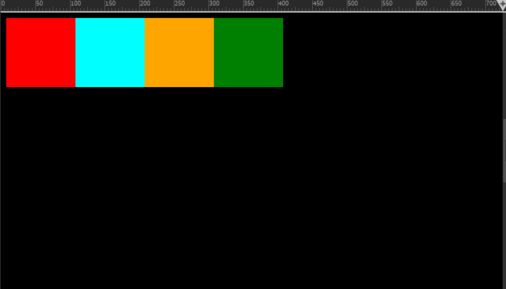
> **flex-end**
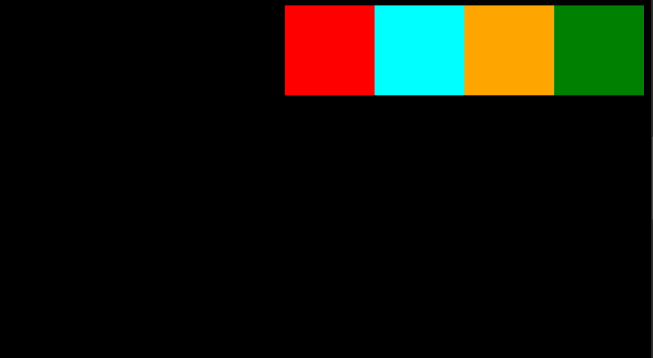
> **space-between**
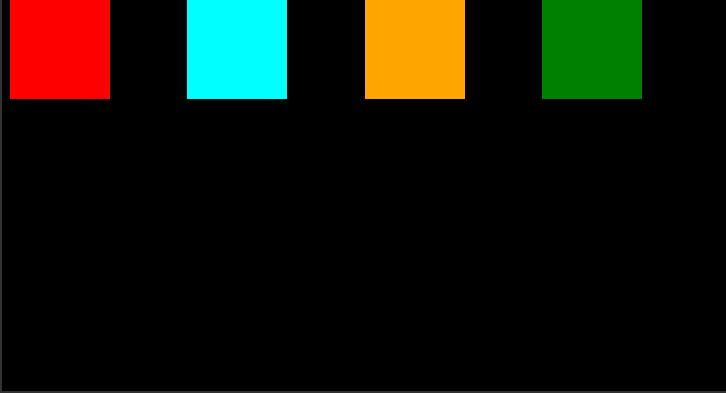
> **center**
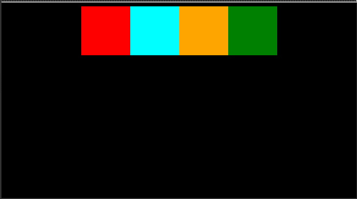
> **space-evenly**
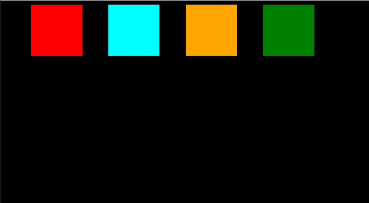
> **space-around**


## **Estilos de escribir codigo CSS**
Existen 3 diferentes maneras de escribir CSS y tienes que escojer una a la hora de hacer Proyectos Grandes:

- **BEM (Bloques,Elementos y Modificadores):** 
Son componentes independientes y autónomos de la interfaz de usuario, como un encabezado, un menú de navegación, una tarjeta de producto, etc. Cada bloque puede contener uno o más elementos, que **son partes de un bloque y tienen un nombre que refleja su relación con el bloque.** Por último, los modificadores son clases que se utilizan para alterar la apariencia o el comportamiento de un bloque o elemento, como un botón activo o una variante de color.

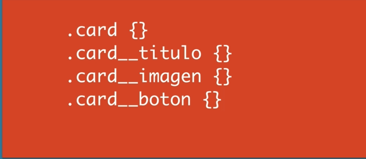

- **Utility first:** Se crean clases de utilidad **para propiedades de estilo específicas**, como el tamaño de la fuente, el color del texto, el espaciado, etc. Estas clases de utilidad se pueden aplicar directamente a los elementos HTML en cualquier lugar de la página, lo que permite una mayor flexibilidad y rapidez en la creación de estilos.


- **Modulos:** se crean archivos CSS separados para cada módulo o componente de la interfaz de usuario. **Cada archivo de módulo contiene todas las reglas de estilo necesarias para ese componente**, incluyendo estilos para los elementos internos del componente. Los estilos se organizan en función de la lógica visual del componente, lo que facilita la comprensión y el mantenimiento del código. Además, los módulos suelen estar diseñados para que sean independientes y no se basen en estilos globales. Esto permite que los módulos se puedan reutilizar en diferentes contextos sin afectar a otros elementos de la página.

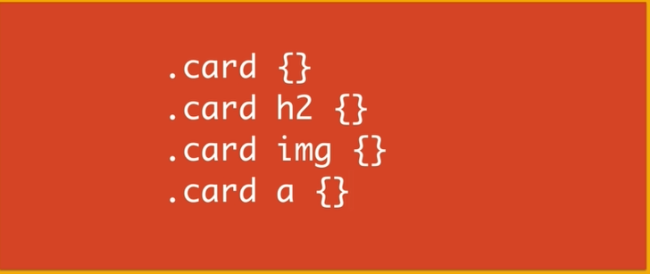

## **Displays**
Es la forma en como se va a acomodar las propiedades de las etiquetas, Ya por defecto las etiquetas html las tienen ya asignadas.

* **Display Block**: El elemento se **_colocara uno debajo del otro_** sin importar el tamaño ni el contenido
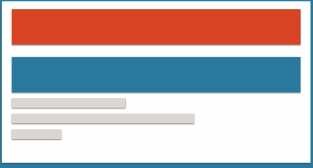

* **Display Inline:** El elemento se posicionara a la derecha una vez que haya tomado el espacio que requiere.
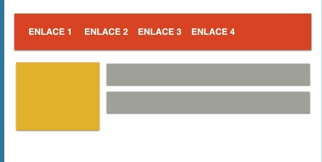

