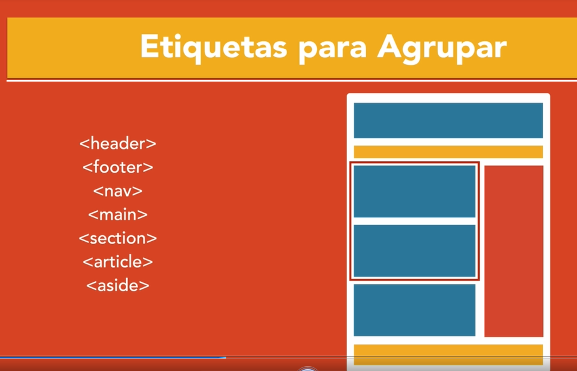
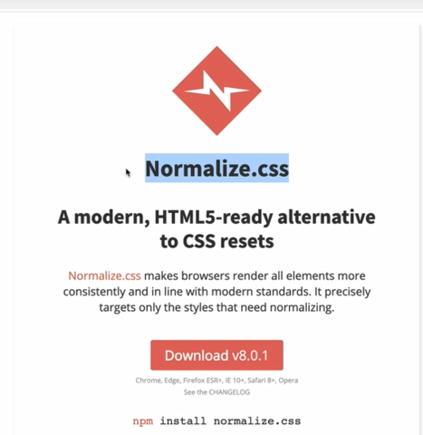
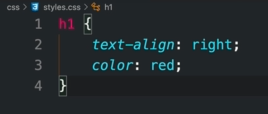

# **Introduccion a Creacion de Paginas Web**
El Lenguaje de Etiquetas HTML es la estructura de una Pagina web ya que sin ella no existen, Es un lenguaje tan simple y no exige mucho. A continuacion empezaremos con algunas etiquetas:

- La primera etiqueta para empezar con nuestro proyecto es:
```html
<html> </html>
```

- Esta etiqueta sirve para que los parrafos tengan una estructura separada entre cada linea y no necesariamente usar el salto de linea
```html
<pre> </pre>
```
- Esta etiqueta sirve para que se separen las lineas horizontalmente y se vaya creando una linea
```html
<hr>
```
- Esta etiqueta sirve para resaltar texto importante de un parrafo
```html
<strong> </strong>
```
> En las etiquetas de html el primero que se abre es el ultimo en cerrarse.

- La Etiqueta `head` sirve para que pongamos informacion entendible para que el navegador lo entienda
```html
<head> </head>
```

- La etiqueta `body` sirve para la informacion que se va a utilizar para el usuario
```html
<body> </body>
```
- La etiqueta `title` nos ayuda a identificar el nombre a nuestra Pagina web
```html
<title> </title>
```

Combinando estas **tres etiquetas** quedaria como:
```html
<html>
    <head>
        <title> Mi primera Pagina web </title>
        </head>
        <body>
            <p> Hola Mundo </p>
            </body>
</html>
```

La etiqueta `h1` sirve para poner titulos y subtitulos  en nuestra pagina html. Va disminuyendo el tamaño conforme el numero que se tenga
```html
<h1> </h1>
```
> Puede Alcanzar hasta el `h6` y no se puede repetir el `h1` ya que el navegador no lo tomaria como importante y es mejor que solo repitamos del (3-6).

La Palbra clave `lorem` + `Tab` Nos ayuda a crear de la nada texto y este tiene el proposito de observar como seria nuestra pagina web con letras antes de pasar la informacion valida
```html
<p> lorem </p>
```
### Ejercicio de Parrafos, Titulos y Nombre de la Pagina

</br>
</br>
---
## **Estructura de una Pagina Web**

- La etiqueta `header` sirve para que se pueda agregar contenido en la **Parte Superior** de una Pagina web
```html
<header></header>
```
  - La etiqueta `footer` sirve para que se pueda agregar contenido en la **Parte Inferior** de una Pagina web
```html
<footer></footer>
```
- La etiqueta `nav` sirve para que se pueda agregar contenido en la **Barra de Navegacion** de una Pagina web
```html
<nav></nav>
```
- La etiqueta `main` sirve para que se pueda agregar el  **Contenido Principal** de una Pagina web
```html
<main></main>
```
- La etiqueta `section` sirve para que se pueda agregar contenido en una **seccion especifica**  de una Pagina web. Solo se va a usar cuando vas a introducir contenido importante a tu pagina web
```html
<section></section>
```
-  La etiqueta `article` sirve para que se pueda agregar contenido en un **articulo especifico**  de una Pagina web
```html
<article></article>
```
-  La etiqueta `aside` sirve para que se pueda agregar contenido en una **barra lateral**  de una Pagina web
```html
<aside></aside>
```
-  La etiqueta `div` sirve para que cuando no puedas utilizar ninguna etiqueta de las anteriores de una Pagina web y para que puedas acomodar algun apartado especifico de la pagina web
```html
<div></div>
```

</br>
</br>

## Tablas
En Html tambien se pueden crear tablas pero para eso necesitamos conocer sus etiqueta `table` y las que esta lleva.

- La etiqueta `table` es la principal que se usa ya que debido es la estructura general de la tabla.
```html
<table></table>
```
- La etiqueta `td` sirve para que nosotros pongamos informacion en nuestra tabla
```html
<table border="5px">
  <td>Hola Mundo</td>
  <td>¿Como estas?</td>
</table>
```
> En pocas palabras esta etiqueta representa las columnas y el atributo **`border`** es para que pongamos el ancho de las lineas que conforman la tabla

- La etiqueta `tr` son las filas que va a contener nuestra tabla.
```html
<table border="5px">
  <tr>
    <td>Hola Mundo</td>
  </tr>
  <tr>
    <td>¿Como estas?</td>
  </tr>
</table>
```
> Nuestra tabla ahora tiene 2 filas con una columna

- La etiqueta `th` hace la misma funcion que la etiqueta anterior solo que la diferencia es que las letas estan en negritas
```html
<table border="5px">
        <tr>
          <th>Hola Mundo</th>
        </tr>
        <tr>
          <th>¿Como estas?</th>
        </tr>
      </table>
```
> Puedes manipular el tamaño de las filas y columnas por medio de css con el atributo **`Width`** y **`Height`**

- La etiqueta **`caption`** sirve para ponerle un nombre a una tabla en especifico.
```html
<table border="5px">
<caption>Comandos Basicos</caption>
    <tr>
        <th>Hola Mundo</th>
   </tr>
    <tr>
          <th>¿Como estas?</th>
    </tr>
      </table>
```


## **Uso de Enlaces y Imagenes**
Para que nosotros podamos usar la etiqueta `nav` y creemos nuestra barra de navegacion necesitamos de las sigueentes etiquetas

- La etiqueta `a` nos va a servir para que nos muestre el texto y se acomode en la barra de navegacion
```html
<a></a>
```
Pero necesitamos agregar **Atributos** para que cumpla con su funcion que en este caso se le llama `href` y este nos va a ayudar a poner enlaces a nuestra pagina
```html
<a href="">Texto</a>
```


> Recuerda que tambien puedes usar **Archivos Gif** en tus documentos html  y el atributo **`usemap`** te ayuda a identificar a la imagen para poder trabajar con ella y escojer el espacio.
```html
<!--Aqui especificamos nuestra imagen y el nombre que se va a usar en el usemap-->

```
> El nombre que se pone en el `usemap` empieza con un #

* La etiqueta **`map:`** Este se usa para trabajar con el contorno que escojimos y especificamos
```html
<map name="workmap"></map>
```
> Dentro de esta etiqueta vamos a trabajar con una nueva etiqueta llamada **`area`**

* La etiqueta **`area`** aqui es donde especificaremos las medidas dentro de la imagen para crear nuestro **espacio**.
```html
<map name="workmap">
<area shape="rect" coords="804,275,588,470" href="Practica/index.html">  
</map>
```
> El atributo **`shape`** sirve para especificar la forma geometrica que va a tener el espacio a escojer, el siguiente atributo **`coords`** son las coordenadas donde se ubica el contorno del espacio.


## Imagenes
Las imagenes son una parte indispensable en nuestra pagina web,pero como seria en html. Bueno llegaste al lugar correcto

- La etiqueta `img` se usa para agregar imagenes a la pagina y solo tiene llaves de apertura. Pero este se va a acompañar con un atributo llamado `src`
> Tambien se puede poner los atributos `alt` para agregar texto cuando haya error en cargar la imagen y tambien esta las propiedades `width` y `height`
```html
</picture>
```
> Dentro de esta se van a trabajar con mas etiquetas llamadas **`Source`** y con la que vimos anteriormente **`img`**

- La etiqueta `source` nos sirve para poner la condicion que queramos que suceda para que muestre cierto contenido.
```html
<picture>
<source media="(max-width:500px)" srcset="img/BEM.PNG">
<source media="(min-width:800px)" srcset="img/center.PNG">
 <
</picture>
```
> Las condiciones van dentro del atributo del **`media`** y en el **`srcset`** va a ir la imagen que se va a mostrar cuando cumpla con la condicion. Si quieres agregar mas condiciones usa la palabra clave **`and`**
```html
<picture>
    <source media="(min-width:500px) and (max-width:800px)" srcset="img/BEM.PNG">
    <source media="(min-width:801px) and (max-width:1024px)" srcset="img/center.PNG">
<
</picture>
```

## **Formulario**
Para qe nosotros creemos Formularios se debe de usar la etiqueta `form`. Pero esto no basta ya que necesita tambien mas etiquetas:
```html
<form></form>
```
* La etiqueta `legend` sirve para poner indicaciones a los usuarios.
```html
<legend></legend>
```
* La etiqueta `fieldset` se utiliza para agrupar elementos relacionados en un formulario y definir una sección con un borde alrededor del conjunto de elementos
```html
<fieldset></fieldset>
```
* La etiqueta `label` Sirve para que le pongamos un nombre a un campo en especifico
```html
<label> Nombre </label>
```
* La etiqueta `input` sirve para agregar los campos donde el usuario va a poner la informacion que se le pide y existen muchos tipos de input. Este de tipo tipo **Texto**.
```html
<input type="text">
```
- La propiedad del `placeholder` ayuda a que aparezca texto dentro del campo donde el usuario pondra la informacion.
```html
<input type="text" placeholder="Nombre">
```
* La etiqueta `textarea` es un campo amplio que nos ayuda a que el usuario escriba contenido mas extenso.
```html
<textarea></textarea>
```
* La etiqueta `button` nos ayuda a crear un boton para que realize na cierta accion en nuestro formulario.
```html
<button type="submit">Texto</button>
```


* La etiqueta `span` nos ayuda a dividir un elemento dentro de una etiqueta:
```html
<span> </span>
```

## Recursos Externos
* La etiqueta `link` nos ayuda a poner nuestros recursos que vayamos a usar en la pagina web ya sea iconos,hojas de estilo,scripts,etc.
```html
<link rel="icon" type="image/x-icon" href="img/social_user_avatar_profile_boy_icon_255751.ico">

```
> Los atributos **`rel`** es para especificar que recurso usaremos y el **`type`** es un atributo que nos ayuda a especificar el tipo de formato del recurso.

### **Hojas de Estilo CSS a HTML**
Existen dos formas para poner las hojas de estilo de css a nuestro codigo y son las siguientes:

- **Directamente en el codigo html:** Este se basa en usar una etiqueta llamada `style` y ponerlo en una parte especifica del codigo:
```html
<style> </style>
```


- **Archivo Externo:** Este es muy util ya que nos ahorramos en buscar codigo y cambiar. Este se basa en crear un archivo dentro de la carpeta y poner nuestros estilos ahi mismo en vez de directamente del codigo: 



&#9650; Para enlazar nuestro codigo a html tenemos que que usar la etiqueta `link` con sus atributos `href` y `rel`. Mayormente este se pone en el `head`:
```html
<link href="Ruta de nuestro css" rel="stylesheet">
```
&#9650; Si queremos que nuestra pagina cargue devolada en lo que respecta del estilo css podemos usar la siguiente etiqueta:
```html
<link rel:"preload" href="ruta de nuestro archivo.css" as="style">
```